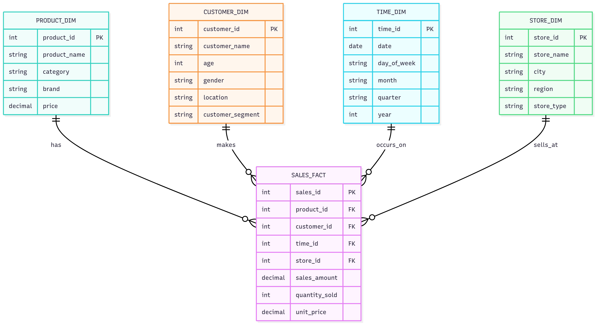
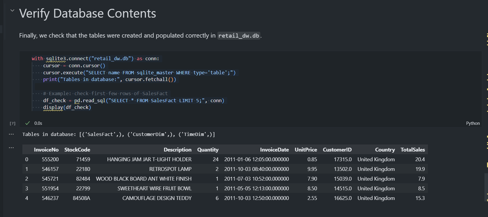
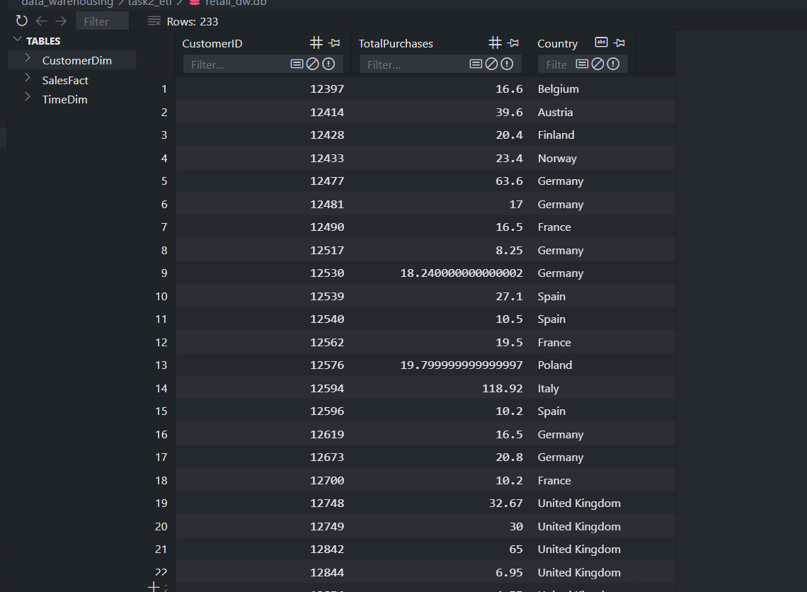

## Section 1: Data Warehousing (50 Marks)

### Task 1: Data Warehouse Design (15 Marks)

**Scenario:**  
We are designing a data warehouse for a retail company that sells products across multiple categories (e.g., electronics, clothing). The company tracks **sales**, **customers**, **products**, and **time**.

The data warehouse must support queries such as:  
- Total sales by product category per quarter.  
- Customer demographics analysis.  
- Inventory trends.  

---

### 1. Star Schema Design

**Fact Table: `fact_sales`**  
- **Measures:**  
  - `sales_amount`  
  - `quantity`  
- **Foreign Keys:**  
  - `customer_id`  
  - `product_id`  
  - `time_id`  

**Dimension Tables:**

1. **`dim_customer`**  
   - `customer_id` (PK)  
   - `name`  
   - `location`  
   - `age_group`  

2. **`dim_product`**  
   - `product_id` (PK)  
   - `name`  
   - `category`  
   - `brand`  

3. **`dim_time`**  
   - `time_id` (PK)  
   - `date`  
   - `quarter`  
   - `year`  

📌 **Schema Diagram:**  

---

### 2. Why Star Schema over Snowflake  
I chose star schema over snowflake because it provides better query performance through fewer joins, making it ideal for OLAP operations like roll-up and drill-down queries. Star schema also offers simpler maintenance and easier understanding for business users, while the slight data redundancy is acceptable given the performance benefits for analytical queries.

---

### 3. SQL CREATE TABLE Statements (SQLite)

```sql
-- Dimension Tables
CREATE TABLE CustomerDim (
    CustomerKey INTEGER PRIMARY KEY AUTOINCREMENT,
    CustomerID VARCHAR(50) NOT NULL UNIQUE,
    CustomerName VARCHAR(100),
    CustomerCountry VARCHAR(100)
);

CREATE TABLE ProductDim (
    ProductKey INTEGER PRIMARY KEY AUTOINCREMENT,
    StockCode VARCHAR(50) NOT NULL UNIQUE,
    Description VARCHAR(255),
    Category VARCHAR(50)
);

CREATE TABLE TimeDim (
    TimeKey INTEGER PRIMARY KEY AUTOINCREMENT,
    FullDate DATE NOT NULL UNIQUE,
    DayOfMonth INTEGER,
    Month INTEGER,
    Quarter INTEGER,
    Year INTEGER
);

-- Fact Table
CREATE TABLE SalesFact (
    SalesFactKey INTEGER PRIMARY KEY AUTOINCREMENT,
    TimeKey INTEGER NOT NULL,
    ProductKey INTEGER NOT NULL,
    CustomerKey INTEGER NOT NULL,
    Quantity INTEGER NOT NULL,
    UnitPrice REAL NOT NULL,
    TotalSales REAL NOT NULL,
    FOREIGN KEY (TimeKey) REFERENCES TimeDim(TimeKey),
    FOREIGN KEY (ProductKey) REFERENCES ProductDim(ProductKey),
    FOREIGN KEY (CustomerKey) REFERENCES CustomerDim(CustomerKey)
);
```
## Section 2: ETL Process Implementation

**Dataset Used:**  
[Online Retail dataset - UCI ML Repository](https://archive.ics.uci.edu/dataset/352/online+retail)  
(Downloaded as CSV and loaded into a pandas DataFrame. All missing values and incorrect data types were handled.)

---

### 1. Extract
- Read the dataset into a pandas DataFrame.
- Converted `InvoiceDate` column to datetime.
- Removed rows with missing `CustomerID` values.
- Ensured all numeric columns had correct data types.


---

### 2. Transform
- Added a **`TotalSales`** column: `Quantity * UnitPrice`.
- Created a **Customer Summary** table by grouping by `CustomerID` to get:
  - Total purchases  
  - Associated country  
- Filtered transactions to only include sales from **August 12, 2024 to August 12, 2025**.
- Removed outliers where:
  - `Quantity < 0`  
  - `UnitPrice <= 0`

---

### 3. Load
- Created a SQLite database file: **`retail_dw.db`**.
- Loaded transformed data into:
  - **Fact Table:** `SalesFact`
  - **Dimension Tables:** `CustomerDim`, `TimeDim`

---

### 4. ETL Function & Logging
- Implemented the ETL process inside a single function.
- Added logging to:
  - Record number of rows processed at each stage.
  - Capture and report errors.
- Code is well-commented for clarity.

**Screenshots**



---

### Submission Files
- **etl_retail.ipynb** / **etl_retail.ipynb** — Python ETL code
- **retail_dw.db** — SQLite database file
- **online_retail.csv** — Dataset (or generated synthetic CSV)
- **Screenshots** — Database tables post-load


