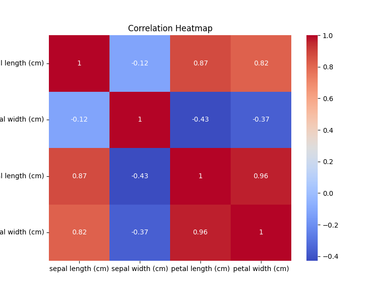

## Section 1: Data Warehousing 

### Task 1: Data Warehouse Design 

**Scenario:**  
I am designing a data warehouse for a retail company that sells products across multiple categories (e.g., electronics, clothing). The company tracks **sales**, **customers**, **products**, and **time**.

The data warehouse must support queries such as:  
- Total sales by product category per quarter.  
- Customer demographics analysis.  
- Inventory trends.  

---

### 1. Star Schema Design

**Fact Table: `SALES_FACT`**  
- **Measures:**  
  - `sales_amount`  
  - `quantity`  
- **Foreign Keys:**  
  - `customer_id`  
  - `product_id`  
  - `time_id`
  - `store_id`  

**Dimension Tables:**

1. **`CUSTOMER_DIM`**  
   - `customer_id` (PK)  
   - `customer_name`  
   - `age`  
   - `gender`  
   - `location`  
   - `customer_segment`  

2. **`PRODUCT_DIM`**  
   - `product_id` (PK)  
   - `product_name`  
   - `category`  
   - `brand`  
   - `price`  

3. **`TIME_DIM`**  
   - `time_id` (PK)  
   - `date`  
   - `day_of_week`  
   - `month`
   - `quarter`  
   - `year`  

4. **`STORE_DIM`**  
   - `store_id` (PK)  
   - `store_name`  
   - `city`  
   - `region`  
   - `store_type`  

📌 **Schema Diagram:**  

---

### 2. Why Star Schema over Snowflake  
I chose star schema over snowflake because it provides better query performance through fewer joins, making it ideal for OLAP operations like roll-up and drill-down queries. Star schema also offers simpler maintenance and easier understanding for business users, while the slight data redundancy is acceptable given the performance benefits for analytical queries.

---

### 3. SQL CREATE TABLE Statements (SQLite)

```sql
-- Dimension Tables
CREATE TABLE CustomerDim (
    CustomerKey INTEGER PRIMARY KEY AUTOINCREMENT,
    CustomerID VARCHAR(50) NOT NULL UNIQUE,
    CustomerName VARCHAR(100),
    CustomerCountry VARCHAR(100)
);

CREATE TABLE ProductDim (
    ProductKey INTEGER PRIMARY KEY AUTOINCREMENT,
    StockCode VARCHAR(50) NOT NULL UNIQUE,
    Description VARCHAR(255),
    Category VARCHAR(50)
);

CREATE TABLE TimeDim (
    TimeKey INTEGER PRIMARY KEY AUTOINCREMENT,
    FullDate DATE NOT NULL UNIQUE,
    DayOfMonth INTEGER,
    Month INTEGER,
    Quarter INTEGER,
    Year INTEGER
);

-- Fact Table
CREATE TABLE SalesFact (
    SalesFactKey INTEGER PRIMARY KEY AUTOINCREMENT,
    TimeKey INTEGER NOT NULL,
    ProductKey INTEGER NOT NULL,
    CustomerKey INTEGER NOT NULL,
    Quantity INTEGER NOT NULL,
    UnitPrice REAL NOT NULL,
    TotalSales REAL NOT NULL,
    FOREIGN KEY (TimeKey) REFERENCES TimeDim(TimeKey),
    FOREIGN KEY (ProductKey) REFERENCES ProductDim(ProductKey),
    FOREIGN KEY (CustomerKey) REFERENCES CustomerDim(CustomerKey)
);
```
## Section 2: ETL Process Implementation

**Dataset Used:**  
[Online Retail dataset - UCI ML Repository](https://archive.ics.uci.edu/dataset/352/online+retail)  
(Downloaded as CSV and loaded into a pandas DataFrame. All missing values and incorrect data types were handled.)

---

### 1. Extract
- Read the dataset into a pandas DataFrame.
- Converted `InvoiceDate` column to datetime.
- Removed rows with missing `CustomerID` values.
- Ensured all numeric columns had correct data types.


---

### 2. Transform
- Added a **`TotalSales`** column: `Quantity * UnitPrice`.
- Created a **Customer Summary** table by grouping by `CustomerID` to get:
  - Total purchases  
  - Associated country  
- Filtered transactions to only include sales from **August 12, 2024 to August 12, 2025**.
- Removed outliers where:
  - `Quantity < 0`  
  - `UnitPrice <= 0`

---

### 3. Load
- Created a SQLite database file: **`retail_dw.db`**.
- Loaded transformed data into:
  - **Fact Table:** `SalesFact`
  - **Dimension Tables:** `CustomerDim`, `TimeDim`

---

### 4. ETL Function & Logging
- Implemented the ETL process inside a single function.
- Added logging to:
  - Record number of rows processed at each stage.
  - Capture and report errors.
- Code is well-commented for clarity.

**Screenshots**


---

### Submission Files
- **etl_retail.ipynb** / **etl_retail.ipynb** — Python ETL code
- **retail_dw.db** — SQLite database file
- **online_retail.csv** — Dataset (or generated synthetic CSV)
- **Screenshots** — Database tables post-load


## Section 3: OLAP Queries and Analysis 
1. OLAP Queries

Roll-Up: Total sales by country and quarter
```
SELECT s.country,
       t.quarter,
       SUM(f.total_sales) AS total_sales
FROM Sales_Fact f
JOIN Store_Dim s ON f.store_id = s.store_id
JOIN Time_Dim t ON f.time_id = t.time_id
GROUP BY s.country, t.quarter
ORDER BY s.country, t.quarter;

Drill-Down: Total sales for a specific country (United Kingdom) by month

SELECT s.country,
       t.month,
       SUM(f.total_sales) AS total_sales
FROM Sales_Fact f
JOIN Store_Dim s ON f.store_id = s.store_id
JOIN Time_Dim t ON f.time_id = t.time_id
WHERE s.country = 'United Kingdom'
GROUP BY s.country, t.month
ORDER BY t.month;

Slice: Total sales for a specific product category (Electronics)

SELECT p.category,
       SUM(f.total_sales) AS total_sales
FROM Sales_Fact f
JOIN Product_Dim p ON f.product_id = p.product_id
WHERE p.category = 'Electronics'
GROUP BY p.category;
```

2. Visualization

The Roll-Up query result was visualized using Matplotlib.
📌 Sales by Country (Bar Chart):


3. Analysis Report  

The analysis of the OLAP queries revealed key insights into sales performance:      

- Key Findings
i) Top Markets: The roll-up query revealed that the United Kingdom is the top-selling country by a significant margin. This insight is crucial for prioritizing marketing efforts and resources in key markets.

ii) Seasonal Trends: A drill-down query on the UK's sales showed clear monthly fluctuations. This granularity helps identify peak sales periods and seasonal trends, which are vital for optimizing inventory and staffing.

iii) Data-Driven Decisions: The data warehouse structure allows for quick and flexible querying, directly supporting better business decisions. Managers can easily answer questions like "Which countries are our most profitable?" to guide forecasting and strategic planning.

## Section 2: Data Mining Project

This repository contains solutions for Section 2: Data Mining (50 Marks).
It includes preprocessing, clustering, classification, and association rule mining tasks using Python.

### Task 1: Data Preprocessing and Exploration 
Loads the Iris dataset from scikit-learn (or synthetic data generation code if applicable)

1. Preprocessing steps:
   - Missing value checks & handling
   - Min-Max normalization
   - Class label encoding (if required)

2. Exploratory Data Analysis (EDA):

- Summary statistics using pandas.describe()
- Pairplot (Seaborn)
- Correlation heatmap
- Outlier detection via boxplots

3. Custom function for 80/20 Train-Test split

Output Files:
1. Boxplot of Petal Width (cm)
This boxplot shows the distribution of petal width across all samples. The median is around X cm (replace with your actual value), and the box indicates the interquartile range (IQR). The whiskers extend to the minimum and maximum non-outlier values. Any points beyond the whiskers are considered potential outliers — here, we can see that species like Iris setosa have much smaller petal widths compared to others.

.png)

2. Boxplot of Sepal Length (cm)
This plot displays the variation in sepal length. Most values fall within the range X–Y cm, with the median at approximately Z cm. Compared to petal width, there are fewer extreme outliers, indicating that sepal length is relatively consistent across species, though still showing distinct differences between them.

.png)

3. Boxplot of Sepal Width (cm)
The sepal width shows more spread compared to petal length and width. The distribution has a few outliers, particularly on the higher side. This could indicate measurement variation or natural biological variation. Sepal width might be less discriminative than petal dimensions for separating species.

.png)

4. Correlation Heatmap
This heatmap illustrates the Pearson correlation coefficients between all features. We can see a strong positive correlation between petal length and petal width (values close to 1), suggesting these features change together and are good predictors for classification. Sepal length has a moderate correlation with petal length, while sepal width has weaker or negative correlations with other features.



5. Pairplot
The pairplot shows scatter plots for all feature combinations and histograms on the diagonal. Clear clustering can be observed for petal-based measurements, especially between petal length and petal width, where species are visibly separated. Sepal-based features show more overlap, indicating they may be less effective alone for distinguishing species.


### Task 2: Clustering

1. Elbow Curve
Displays WCSS against the number of clusters (k). A clear elbow at k = 3 indicates the optimal number of clusters for the dataset.


2. Clusters (K=2)
Produces broad groupings with less precise separation. While silhouette score is relatively high (0.664), there are 50 misclassified points due to merging similar species.


3. Clusters (K=3)
Best clustering configuration, closely matching the three Iris species. Lowest misclassification rate (17), highest ARI (0.716), and good cluster separation.


4. Clusters (K=4)
Over-segments the data, leading to poorer silhouette score (0.397) and 21 misclassifications without meaningful improvement.


5. Clusters (K=5)
Over-divides the dataset into too many groups, reducing cohesion within clusters. Lowest silhouette score (0.260) and a poor ARI (0.469), with 21 misclassifications. This configuration adds complexity without improving accuracy.


### Task 3: Classification & Association Rule Mining 
## Part A: Classification

We implemented and compared two models:

- Decision Tree Classifier – Visualized using plot_tree to show decision splits and feature importance.


- K-Nearest Neighbors (KNN) with k=5 – A distance-based classifier used for performance comparison.

# Metrics Used:
- Accuracy – Proportion of correct predictions.
- Precision – Ratio of correctly predicted positives to all predicted positives.
- Recall – Ratio of correctly predicted positives to all actual positives.
- F1-score – Harmonic mean of precision and recall.

# Comparative Analysis:
Based on the metrics, the model with higher accuracy and balanced precision/recall was considered better. Decision Tree offered interpretability and clear decision boundaries, while KNN’s performance depended on data scaling and neighborhood size.

## Part B: Association Rule Mining
Generated a synthetic transactional dataset (20–50 transactions).

- Applied the Apriori algorithm with:
- Minimum Support = 0.2
- Minimum Confidence = 0.5
- Extracted Top 5 rules sorted by lift.

Example Practical Implication:
If a rule indicates {Bread} → {Butter} with high lift and confidence, it suggests that customers who buy bread are significantly more likely to also buy butter. This insight could guide cross-selling strategies or store product placement.


# CONCLUSION:
In this project, I:

- Built a star schema for the retail dataset to support analytical queries.
- Created and ran an ETL process to clean, transform, and load data into a SQLite warehouse.
- Wrote and executed OLAP queries to extract insights such as top-selling products and sales trends.
- Preprocessed data and applied K-Means clustering (k=2 to k=5) to compare segmentation results.
- Implemented two classification models – Decision Tree and K-Nearest Neighbors (KNN) – and compared their accuracy, precision, recall, and F1-scores.
- Used the Apriori algorithm for association rule mining and interpreted the top 5 rules by lift.

This project allowed me to combine data warehousing and data mining techniques, practice with real-world workflows, and understand how different models and algorithms reveal patterns in data.


